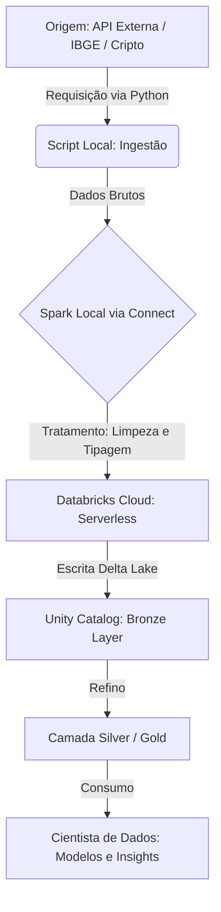

# 🚀 Experiência e Pipeline: Da Infrestrututa ao Insight

## 📝 Sugestão para o LinkedIn

**Título: Maturidade em Dados: Quando o código encontra a infraestrutura real.** 🧱✨

Maturidade é entender que ser um Cientista de Dados hoje vai muito além de importar bibliotecas de ML. É sobre construir pontes seguras entre o "dado bruto" e a tomada de decisão. 

Passei as últimas horas em um verdadeiro "sufoco" técnico, enfrentando incompatibilidades de versões de Python (quem nunca?), configurando ambientes virtuais e garantindo que o **Databricks Connect** funcionasse perfeitamente no modo **Serverless**. 🥵

**A recompensa?** 
Conectar meu computador diretamente ao coração do Databricks na nuvem. Em segundos, passei de uma API de criptoativos para os indicadores socioeconômicos reais do IBGE para minha cidade, **Rio das Ostras**. 🌊🏠

Ver o Spark processar localmente o PIB, a População e o IDH, e "empurrar" esses dados tratados diretamente para o **Unity Catalog** (Medallion Architecture), é onde a mágica acontece. Onde o "sufoco" vira escalabilidade.

**Minhas lições aprendidas:**
1. **Infraestrutura importa**: O Databricks Connect + Serverless é o auge da agilidade e economia.
2. **Governança é chave**: Usar caminhos claros (Bronze/Silver/Gold) no Unity Catalog garante que o dado é confiável.
3. **Pé no chão**: Ser um cientista maduro é saber que o dado que alimenta seu modelo precisa ser íntegro, limpo e governado.

O SparkBrick está pronto. E você, como tem lidado com a base da sua pirâmide de dados? 🌌🚀

#DataScience #DataEngineering #Databricks #Spark #RioDasOstras #IBGE #Python #MaturidadeProfissional

---

## 🛠️ Fluxograma do Procedimento

---

## 🧠 Guia Conceitual para o Cientista de Dados

### 1. Como obter as informações? (Obtenção)
*   **API**: Você "pede" o dado para um serviço web (ex: IBGE). O resultado vem em um formato bagunçado chamado JSON.
*   **SQL**: Quando o dado já está no Databricks, você usa comandos `SELECT` para buscar o que já foi minerado.

### 2. O que é "Tratar" os dados?
É o processo de "dar banho" no dado. No nosso exemplo do IBGE:
*   A API mandava o PIB com vírgula (`R$ 67.734,87`).
*   O Spark **tratou** isso removendo a vírgula para ponto e transformando em número real (`67734.87`) para que você possa fazer cálculos matemáticos.

### 3. Spark vs. Databricks: Qual o papel de cada um?
*   **Spark**: É o "Motor". É ele quem faz a força bruta do processamento, filtra as linhas e calcula as médias de milhões de registros.
*   **Databricks**: É a "Garagem e a Pista". Ele fornece os computadores na nuvem (Compute), organiza as tabelas (Catalog) e guarda os arquivos (Storage).

### 4. O que o Cientista faz com o resultado?
Com os dados limpos nas tabelas (especialmente na camada Gold):
*   **Treinamento de Modelos**: Usa os dados do IBGE como "Features" para prever crescimento econômico.
*   **Análise Exploratória (EDA)**: Cria gráficos para entender a distribuição da população.
*   **Storytelling**: Mostra para os stakeholders o impacto dos indicadores na estratégia do negócio.

---

## 📋 Passo a Passo por Números

1.  **Configuração de Ambiente**: Criar o ambiente isolado (`venv_311`) para o Python "conversar" com o Spark sem erros.
2.  **Autenticação**: Configurar o Host e o Token (sua chave secreta) para o Databricks te reconhecer.
3.  **Ingestão**: Criar scripts Python que buscam dados em APIs externas (como IBGE ou CoinGecko).
4.  **Tratamento Spark**: Usar DataFrame Spark para converter textos em números, tratar nulos e adicionar carimbos de data/hora (ingestion_timestamp).
5.  **Transmissão via Connect**: O código que você digita no VS Code roda nos servidores Serverless do Databricks na nuvem.
6.  **Persistência no Unity Catalog**: Gravar o resultado em tabelas Permanentes (Delta Lake), organizadas por níveis de qualidade (Bronze -> Silver -> Gold).
7.  **Análise Final**: O Cientista agora consome as tabelas finais via SQL ou Python para gerar o valor real para o negócio.
