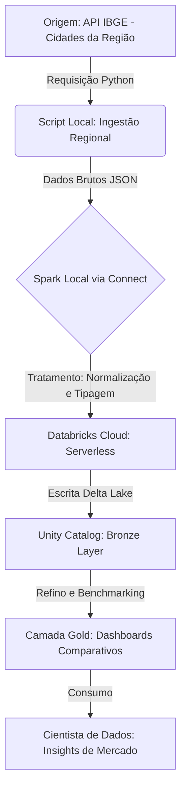

# 🚀 Experiência e Pipeline: Da Infraestrutura ao Insight Regional

## 📝 Sugestão para o LinkedIn (Versão Concisa)

**Título: Maturidade em Dados: Quando o código encontra a infraestrutura real.** 🧱✨

Ser Cientista de Dados vai além de importar bibliotecas de ML. É construir pontes seguras entre o dado bruto e a decisão. 

Enfrentei um verdadeiro "sufoco" técnico hoje: conflitos de versões de Python e ambientes virtuais. Mas a superação veio com o **Databricks Connect Serverless**, conectando meu VS Code local à nuvem em segundos. 🥵

**A Recompensa:** 
Fui de um script local a um **Benchmarking Regional** completo. Comparei indicadores do IBGE (PIB, População, IDH) de **Rio das Ostras** com Macaé, Casimiro, Cabo Frio e Búzios.

Ver o Spark tratar e unificar esses dados no **Unity Catalog** é onde a engenharia encontra a ciência. Conseguir visualizar que Macaé e Rio das Ostras lideram o PIB regional, com dados governados e escaláveis, é o que define um pipeline profissional.

**Lições:**
1. **Infraestrutura**: Databricks Serverless traz agilidade total.
2. **Contexto**: Dados isolados são apenas números. Benchmarking gera insights.
3. **Maturidade**: O dado que alimenta o modelo precisa ser íntegro e auditável.

O SparkBrick está pronto e agora é regional! Como você garante a qualidade dos seus dados? 🌌🚀

#DataScience #DataEngineering #Databricks #Spark #IBGE #RioDasOstras #Macaé #Python #MaturidadeProfissional

---

## 🛠️ Fluxograma do Procedimento Atualizado

---

## 🧠 Guia Conceitual para o Cientista de Dados

### 1. O que é Benchmarking Regional?
É a prática de comparar os indicadores de um local (ex: Rio das Ostras) com seus pares (ex: Macaé). Para um cientista, isso define se um crescimento é uma tendência de mercado ou um fenômeno isolado.

### 2. O que é "Tratar" os dados em escala?
No nosso exemplo, o Spark não apenas limpou os números, ele **unificou** diferentes cidades em uma única estrutura de dados (DataFrame), permitindo que você use um único comando SQL para comparar toda a região.

### 3. O papel do Unity Catalog
Ele funciona como a "Biblioteca Central" da empresa. Garante que se você e outro colega buscarem dados do IBGE, ambos usarão a mesma versão confiável (Single Source of Truth).

---

## 📋 Procedimentos Passo a Passo

1.  **Configuração de Ambiente**: Uso do Python 3.11 no `venv_311` para compatibilidade total com Databricks Runtime 15.1.
2.  **Autenticação Segura**: Uso de variáveis de ambiente (`.env`) para proteger Tokens de acesso.
3.  **Ingestão Multi-Cidade**: Scripts Python que consultam múltiplos códigos IBGE simultaneamente.
4.  **Tratamento Spark**: Conversão de formatos, tratamento de valores nulos e normalização de nomes de colunas.
5.  **Poder Serverless**: Execução local que consome o poder computacional elástico da nuvem.
6.  **Arquitetura Medallion**: Organização dos dados em camadas de qualidade no Unity Catalog.
7.  **Visualização e Ciência**: Criação de Dashboards dinâmicos para análise de variância regional.
